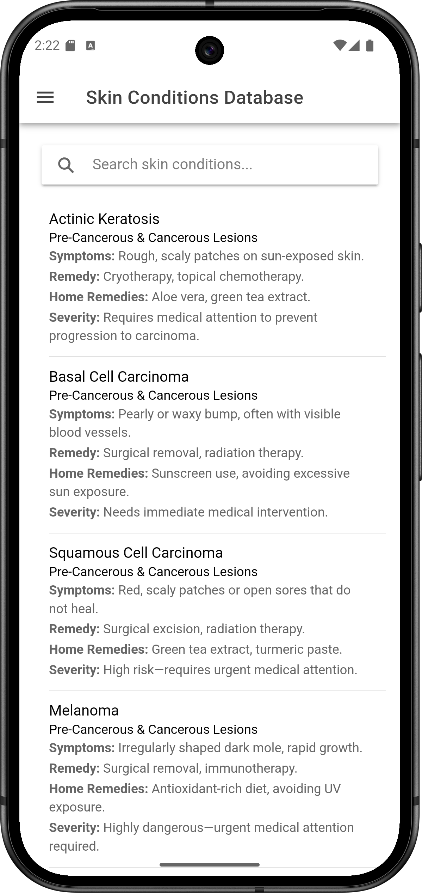

# Skin Health Companion

## 🏆 Project Context & Team Members

This project was developed as part of the **Applied Machine Learning (AML) coursework** at **Chennai Mathematical Institute (CMI)** during this academic year.

### 👨‍💻 Team Members:

- **Shankar Narayanan** (MCS202409)
- **Eada Surya Deva** (MDS202323)

## 📌 Motivation

Early detection and understanding of skin conditions can significantly improve treatment outcomes. This project aims to bridge the gap between dermatological expertise and user-friendly AI-powered diagnostics, particularly in remote healthcare contexts.

## 🚀 Features

- AI-driven skin condition classification.
- Explainability features using Grad-CAM.
- User-friendly interface for seamless interaction.
- Mobile inference optimization for real-time analysis.

## 🔗 References

- [**Comparative Study of Multiple CNN Models for Classification of 23 Skin Diseases** – Amina Aboulmira et al.](https://www.researchgate.net/publication/363156222_Comparative_Study_of_Multiple_CNN_Models_for_Classification_of_23_Skin_Diseases/fulltext/636c91f3431b1f5300867b9e/Comparative-Study-of-Multiple-CNN-Models-for-Classification-of-23-Skin-Diseases.pdf)
- [**Enhancing Skin Disease Classification Leveraging Transformer-based Deep Learning Architectures and Explainable AI** – Jayanth Mohan et al.](https://arxiv.org/abs/2407.14757)

## 📸 App Demo

Below are screenshots demonstrating the app’s functionality:

| **Menu**                                | **Home Screen**                         | **AI diagnosis**                             | **Output and XAI**                        | **DermaWiki**                           | **Find Clinic**                           | **Account and Past Scans**                 |
| --------------------------------------- | --------------------------------------- | -------------------------------------------- | ----------------------------------------- | --------------------------------------- | ----------------------------------------- | ------------------------------------------ |
|  |  |  |  |  |  |  |

## 📥 Download

Download the latest APK here: [Skin Health Companion APK](./App/skin-health-app/android/app/build/outputs/apk/debug/app-debug.apk)
